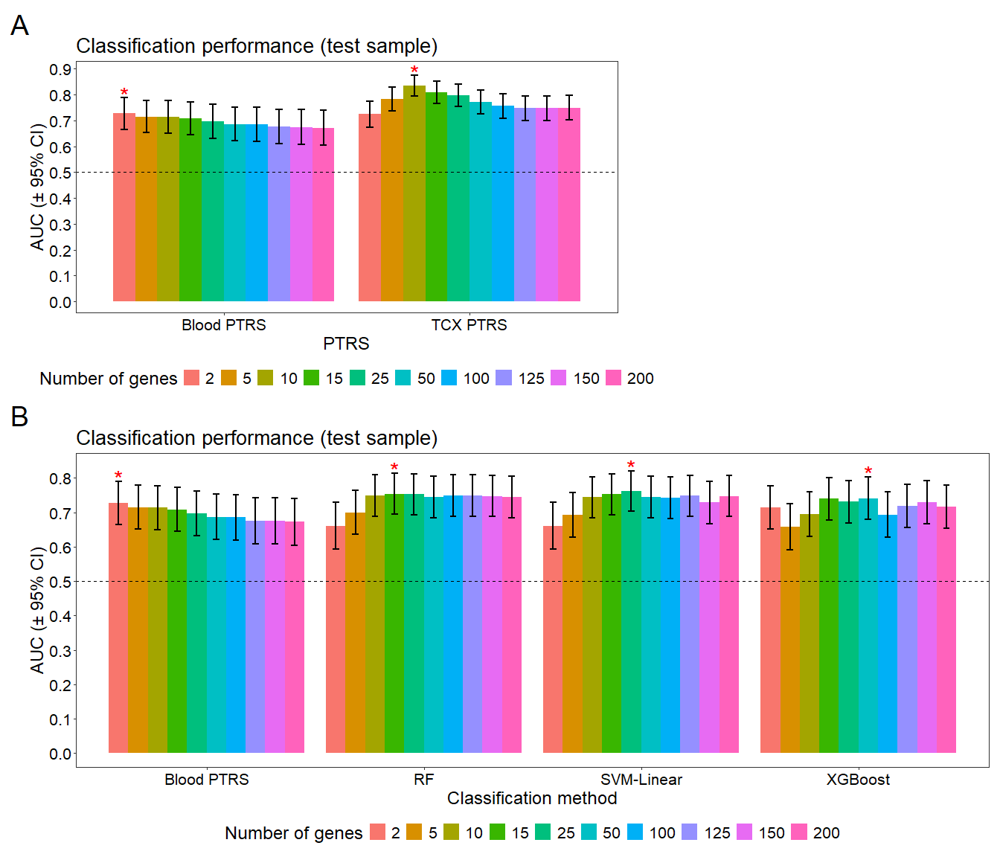

Figure 7: bar plot of AUCs across different classification models
================

Load packages

``` r
require(data.table)
require(plyr)
require(dplyr)
require(ggplot2)
library(patchwork)
```

Read classification performances of ML methods in blood gene expression,
and polytranscript risk scores (PTRSs) in blood and temporal cortex gene
expression data

``` r
#Blood ML performance
sum_ml = fread("D:/AD_gx/Blood_gx/MLA/20221030/20221030_Summary_Of_MLA_Performance_AD_blood.txt")
sum_ml$pval = format(sum_ml$pval, scientific = TRUE, digits = 2)

#Blood PTRS performance
sum_blood = fread("D:/AD_gx/Blood_gx/blood_results/TRS/20220824_6s/20220824_AD_Blood_TRS_prediction_and_regression_Summary_lovestone2_val.txt")
sum_blood$score = factor(sum_blood$score, levels = c(paste0("ptrs_", 1:10)))
top_k_genes = c(2, 5,10, 15, 25, 50, 100, 125, 150, 200)
sum_blood$bin =  factor(top_k_genes, levels = top_k_genes)

#One tailed z-test of significance
sum_blood$valid.se = (sum_blood$valid.upper - sum_blood$valid.lower)/3.92
sum_blood$zscore = (sum_blood$auc_valid.auc - 0.5)/(sum_blood$valid.se)
sum_blood$pval = pnorm(sum_blood$zscore, lower.tail = F)
sum_blood$pval = format(sum_blood$pval, scientific = TRUE, digits = 2)

sum_blood$build = "Blood PTRS"

#Temporal cortex PTRS performance
sum_tcx = fread("D:/AD_gx/Brain_gx/TRS/20220823_temporal/20220823_AD_Brain_TRS_prediction_and_regression_Summary_temporal_mayoeGWAS_val.txt")
sum_tcx$score = factor(sum_tcx$score, levels = c(paste0("ptrs_", 1:10)))
sum_tcx$bin =  factor(top_k_genes, levels = top_k_genes)

#One tailed z-test of significance
sum_tcx$valid.se = (sum_tcx$valid.upper - sum_tcx$valid.lower)/3.92
sum_tcx$zscore = (sum_tcx$auc_valid.auc - 0.5)/(sum_tcx$valid.se)
sum_tcx$pval = pnorm(sum_tcx$zscore, lower.tail = F)
sum_tcx$pval = format(sum_tcx$pval, scientific = TRUE, digits = 2)

sum_tcx$build = "TCX PTRS"
```

Generate the bar plot for blood to compare ML methods and PTRSs

``` r
#Combine the classification performance data from ML methods and PTRSs for blood
sum_ml_get = sum_ml[,c("k","valid.auc","build","valid.lower","valid.upper","pval")]
sum_blood_get = sum_blood[,c("bin","auc_valid.auc","build","valid.lower","valid.upper","pval")]
colnames(sum_blood_get)[1:2] = c("k","valid.auc")

sum_get = rbind(sum_ml_get,sum_blood_get)

#label the most significant model for each classification method
sum_get = sum_get %>% group_by(build) %>% mutate(label = ifelse(valid.auc == max(valid.auc), "*", NA))

p1 =  ggplot(sum_get, aes(x = build, y = valid.auc, fill = factor(k))) +
      geom_bar(stat = "identity", position = position_dodge(width = 0.9)) +
      geom_errorbar(aes(ymin = valid.lower, ymax = valid.upper), linewidth = 1, width = 0.3, show.legend = F, position = position_dodge(width = 0.9)) +
      guides(fill = guide_legend(nrow = 1, byrow = TRUE)) +
      geom_text(aes(label = label, y = valid.upper + .01),  size = 8, col = 'red', position = position_dodge(width = 0.9)) +
      theme_bw() +
      scale_y_continuous(breaks = seq(0, 0.9, by = 0.1)) +
      labs(title = "Classification performance (test sample)", fill = "Number of genes") +
      ylab("AUC (\u00b1 95% CI)") +
      xlab("Classification method") +
      geom_hline(yintercept = 0.5, col = 'black', lty = 2) +
      theme(axis.text = element_text(size = 16, color = 'black'),
            axis.title = element_text(size = 18),
            panel.grid = element_blank(),
            legend.position='bottom',
            legend.text = element_text(size = 16),
            legend.title = element_text(size = 18),
            plot.title = element_text(size = 20))
```

Generate the bar plot to compare PTRSs of blood and PTRSs of temporal
cortex

``` r
#Combine PTRS performance across blood and temporal cortex
sum_ptrs = rbind(sum_blood, sum_tcx)

#label the most significant model for blood or temporal cortex PTRSs
sum_ptrs = sum_ptrs %>% group_by(build) %>% mutate(label = ifelse(auc_valid.auc == max(auc_valid.auc), "*", NA))


p2 =  ggplot(sum_ptrs, aes(x = build, y = auc_valid.auc, fill = bin)) +
      geom_bar(stat = "identity", position = position_dodge(width = 0.9)) +
      geom_errorbar(aes(ymin = valid.lower, ymax = valid.upper), linewidth = 1, width = 0.3, show.legend = F, position=position_dodge(0.9)) +
      guides(fill = guide_legend(nrow = 1, byrow = TRUE)) +
      geom_text(aes(label = label,  y = valid.upper + .01),  size = 8, col = 'red', position=position_dodge(width =0.9)) +
      theme_bw() +
      scale_y_continuous(breaks = seq(0, 0.9, by = 0.1)) +
      labs(title = "Classification performance (test sample)", fill = "Number of genes") +
      ylab("AUC (\u00b1 95% CI)") +
      xlab("PTRS") +
      geom_hline(yintercept = 0.5, col = 'black', lty = 2) +
      theme(axis.text = element_text(size = 16, color = 'black'),
            axis.title = element_text(size = 18),
            panel.grid = element_blank(),
            legend.position='bottom',
            legend.text = element_text(size = 16),
            legend.title = element_text(size = 18),
            plot.title = element_text(size = 20))
```

Combine the two plots

``` r
p = (p2 + plot_spacer() + plot_layout(ncol = 2, widths = c(1.5, 1))) / p1 + plot_layout(ncol = 1, heights = c(0.8, 1)) + 
    plot_annotation(tag_levels = 'A') & theme(plot.tag = element_text(size = 28))

p
```

<!-- -->
