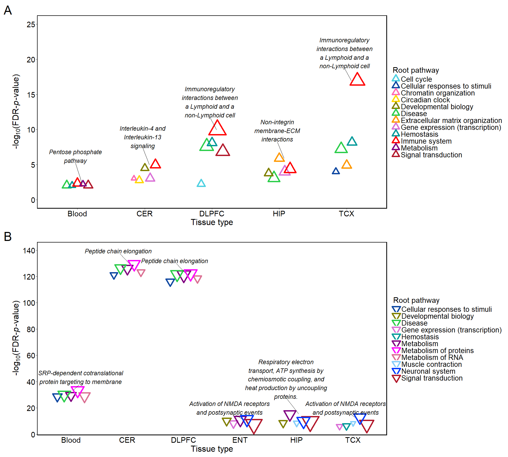

Figure 5: dot plot
================

Load packages

``` r
library(data.table)
library(plyr)
library(ggplot2)
library(dplyr)
library(stringr)
library(scales)
library(ggrepel)
library(patchwork)
```

Read Reactome pathways enriched by AD-associated modules

``` r
wgcna = fread("D:/AD_gx/Brain_gx/WGCNA/20230620_blood_brain_wgcna_sig_path_all_reactome_with_root_and_hubgene.csv")

#reformat root pathway names
wgcna$root_pathname = str_to_sentence(wgcna$root_pathname, locale = "en")
wgcna$root_pathname[wgcna$root_pathname == "Dna repair"] = "DNA repair"
wgcna$root_pathname[wgcna$root_pathname == "Dna replication"] = "DNA replication"
wgcna$root_pathname[wgcna$root_pathname == "Metabolism of rna"] = "Metabolism of RNA"
```

Set color values for each root pathway

``` r
palette =  c( "#B2EBF2", "#80DEEA", "#4DD0E1", "#0D47A1", "#FF69B4", "#FFD700", 
              "#808000", "#2BCD4A", "#AAFF00", "#FFA726", "#FF9800", "#DA70D6",
              "#009999", "#FF0000", "#800080", "#FF00FF", "#DB7093", "#87CEFA", 
              "#0039FF",  "#00AAFF","#FF00AA", "#F48FB1", "#F06292", "#EC407A",
              "#B2182B", "#D6604D", "#F4A582")

color_df = data.frame(name = unique(wgcna$root_pathname)[order(unique(wgcna$root_pathname))] , color = palette)

wgcna = merge(wgcna, color_df, by.x = "root_pathname", by.y = "name", all.x = T)
```

For each tissue, extract out the top 5 down-regulated root pathway
categories based on the most significant sub-pathway within each root
pathway

``` r
#for each tissue, compute the number of sub-pathways within each root pathway
res_down = wgcna[wgcna$direction == "Down",] %>% 
           group_by(region, root_pathname) %>% dplyr::mutate(Count = n())

#for each tissue, find the most significant sub-pathway within each root pathway
res_df = res_down %>%  group_by(region, root_pathname) %>% arrange(P) %>%  filter(row_number()==1)

#create dot label using the most significant sub-pathway within each root pathway
res_df$Label = str_wrap(res_df$tar_pathname,  width = 30)

#alternatively, only use the most significant pathway in each tissue as dot label
res_df = res_df %>%  dplyr::group_by(region) %>% dplyr::mutate(Label2 = if_else(P == min(P),  Label, "none"))
res_df$Label2[res_df$Label2 == "none"] = NA

#use the number of sub-pathways within each root pathway for the dot size
res_df$size = (res_df$Count - min(res_df$Count))/(max(res_df$Count) - min(res_df$Count)) + 10

#keep the top 5 down-regulated root pathways for plot
res_df = res_df %>%  dplyr::group_by(region) %>% arrange(P) %>%  filter(row_number()<=5)
res_df = res_df %>%  dplyr::group_by(region) %>% arrange(desc(P))
```

Reformat tissue names

``` r
res_df$region[res_df$region == "blood"] = "Blood"
res_df$region[res_df$region == "cerebellum"] = "CER"
res_df$region[res_df$region == "entorhinal"] = "ENT"
res_df$region[res_df$region == "frontal"] = "FCX"
res_df$region[res_df$region == "hippocampus"] = "HIP"
res_df$region[res_df$region == "temporal"] = "TCX"
res_df$region[res_df$region == "dlpfc"] = "DLPFC"

res_df$region = factor(res_df$region)

color_set = unique(res_df[,c("root_pathname","color")])
color_set = color_set[order(color_set$root_pathname),]
```

Generate dot plot for top 5 enriched Reactome root pathways across
tissues

``` r
g1 = ggplot(res_df, aes(x = region , y = -log10(FDR)  )) + 
  geom_point(shape= 6, stroke = 3, aes(colour = root_pathname , size = Count), 
             position=position_dodge(width = .6)) + 
  scale_size_continuous(range = c(3,15))+
  scale_colour_manual(values = color_set$color) +
  guides( colour = guide_legend(ncol=1, override.aes = list(size = 6), byrow = TRUE), size = "none") +
  labs(colour = "Root pathway") +
  theme_classic() + 
  theme(axis.text = element_text(size = 22, color = "black"), 
        axis.title = element_text(size = 24), 
        panel.border = element_rect(fill=NA,linewidth = 1.5),
        legend.text = element_text(size = 20),
        legend.title = element_text(size = 22),
        legend.spacing.y = unit(0.5, 'cm')) +
  ggrepel::geom_text_repel(aes(label = Label2, x = as.numeric(factor(region))+0.04), size = 6, fontface = 3,
                           segment.size = 0.2, segment.colour = "grey0", 
                           point.padding = unit(2,"points"), position = ggrepel::position_nudge_repel(x = -0.2, y = 10)) +
  xlab("Tissue type") +
  ylab(expression(paste("-log"[10],"(FDR-",italic(p),"-value)"))) + 
  scale_y_continuous( breaks = seq(0, 140, by = 20))

#g1
```

Repeat the process to generate the plot for up-regulated pathways

``` r
res_up = wgcna[wgcna$direction == "Up",] %>% 
         group_by(region, root_pathname) %>% dplyr::mutate(Count = n())

res_df = res_up %>%  group_by(region, root_pathname) %>% arrange(P) %>%  filter(row_number()==1)
res_df$Label = str_wrap(res_df$tar_pathname,  width = 20)
res_df = res_df %>%  dplyr::group_by(region) %>% dplyr::mutate(Label2 = if_else(P == min(P),  Label, "none"))
res_df$Label2[res_df$Label2 == "none"] = NA
res_df$size = (res_df$Count - min(res_df$Count))/(max(res_df$Count) - min(res_df$Count)) + 10

res_df = res_df %>%  dplyr::group_by(region) %>% arrange(P) %>%  filter(row_number()<=5)
res_df = res_df %>%  dplyr::group_by(region) %>% arrange(desc(P))

res_df$region[res_df$region == "blood"] = "Blood"
res_df$region[res_df$region == "cerebellum"] = "CER"
res_df$region[res_df$region == "entorhinal"] = "ENT"
res_df$region[res_df$region == "frontal"] = "FCX"
res_df$region[res_df$region == "hippocampus"] = "HIP"
res_df$region[res_df$region == "temporal"] = "TCX"
res_df$region[res_df$region == "dlpfc"] = "DLPFC"

res_df$region = factor(res_df$region)

#
color_set = unique(res_df[,c("root_pathname","color")])
color_set = color_set[order(color_set$root_pathname),]


g2 = ggplot(res_df, aes(x = region , y = -log10(FDR) )) + 
  geom_point(shape= 2, stroke = 3, aes(colour = root_pathname , size = Count), position =position_dodge(width = .4)) + 
  scale_size_continuous(range = c(3,15))+
  scale_colour_manual(values = color_set$color) +
  guides( colour = guide_legend(ncol=1, override.aes = list(size = 5), byrow = TRUE), size = "none") +
  labs(colour = "Root pathway") +
  theme_classic() + 
  theme(axis.text = element_text(size = 22, color = "black"), 
        axis.title = element_text(size = 24), 
        panel.border = element_rect(fill=NA,linewidth = 1.5),
        legend.text = element_text(size = 20),
        legend.title = element_text(size = 22),
        legend.spacing.y = unit(0.5, 'cm')) +
  ggrepel::geom_text_repel(aes(label = Label2, x = as.numeric(factor(region))+0.07), size = 6, 
                           segment.size = 0.2, segment.colour = "grey0", fontface = 3, 
                           position = ggrepel::position_nudge_repel(x = -0.1, y = 4)) +
  xlab("Tissue type") +
  ylab(expression(paste("-log"[10],"(FDR-",italic(p),"-value)"))   ) +
  ylim(0, 25) 

#g2
```

Combine the two plots

``` r
p = g2 + g1  + plot_layout(ncol = 1) + plot_annotation(tag_levels = 'A') & theme(plot.tag = element_text(size = 35))
p
```

<!-- -->
