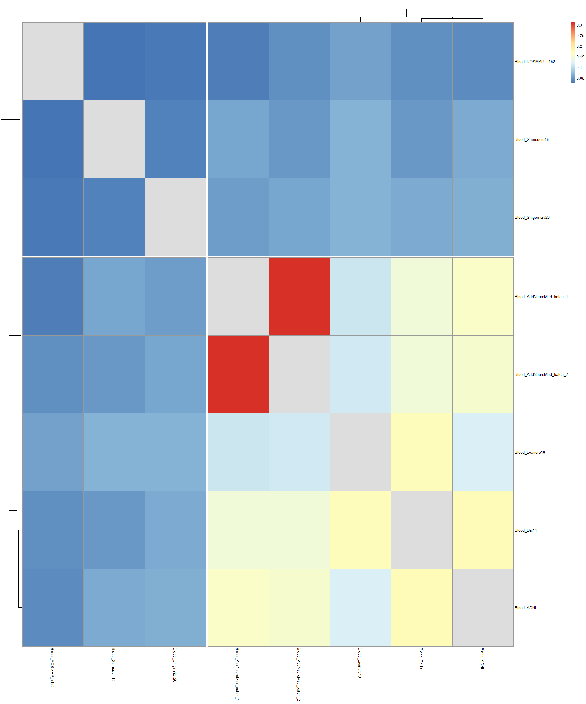
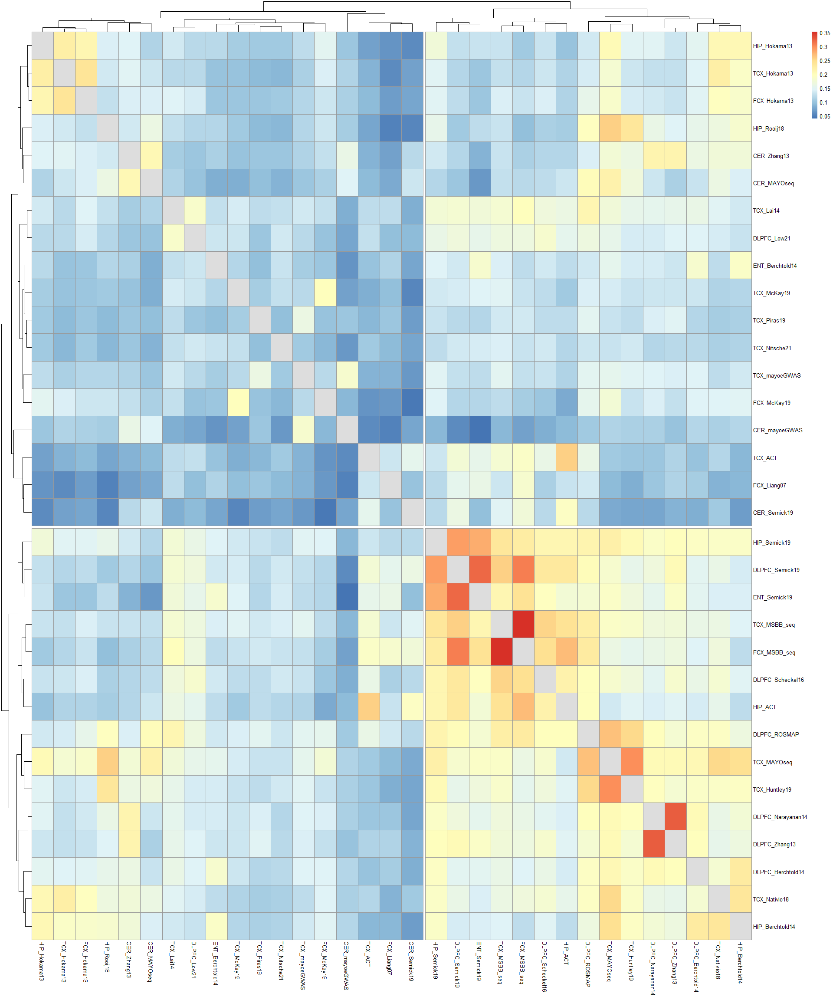
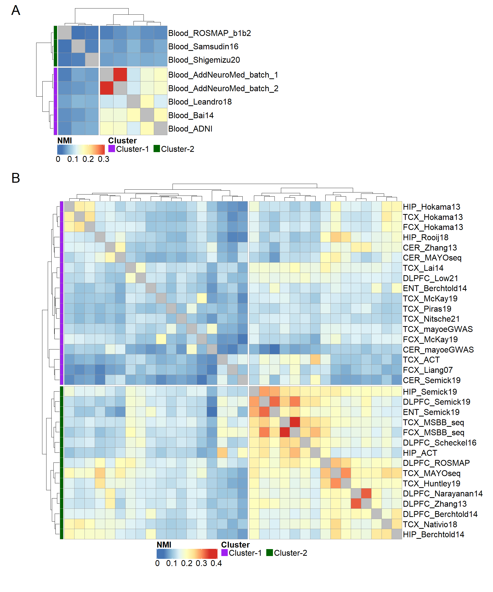

Figure 6: heatmap plot of NMI for blood and brain
================

Load packages

``` r
library(data.table)
library(plyr)
library(ggplot2)
library(dplyr)
library(tidyverse)
library(pheatmap)
library(ComplexHeatmap)
library(gridExtra)
library(grid)
```

Read NMI values

``` r
Cfolder = "D:/AD_gx/ARI_NMI"
if(!dir.exists(Cfolder)){
  dir.create(Cfolder)
}
setwd(Cfolder)

#read the module partition similarity NMI values
nmi_all = data.frame(fread("20230503_AD_wgcna_module_3KpcGene_all_study_NMI.csv"))
row.names(nmi_all) = nmi_all$V1
nmi_all = nmi_all[,-1]
```

Generate NMI heatmap plot for blood studies

``` r
#extract NMI values for blood studies
nmi_blood = nmi_all[grepl("Blood", rownames(nmi_all)),grepl("Blood", colnames(nmi_all))]

nmi_trix = as.matrix(nmi_blood)
diag(nmi_trix) = NA

#heatmap with two clusters using pheatmap
g1 = pheatmap::pheatmap(nmi_trix, 
                          cutree_rows = 2,
                        cutree_cols = 2)
```

<!-- -->

``` r
dev.off()
```

    ## null device 
    ##           1

``` r
#add tissue annotation
cluster_df = data.frame(Cluster = cutree(g1$tree_row, k=2))
cluster_df = cluster_df[g1$tree_row$order, , drop = F]

cluster_df$Cluster = paste0("Cluster",cluster_df$Cluster)
annoCol<-list(Cluster=c(Cluster1 = "purple",Cluster2 = "darkgreen"))

#create custom legend
lgd_list = list(Legend(labels = c("Cluster-1", "Cluster-2"), title = "Cluster", 
                       legend_gp = gpar(fill = c("purple", "darkgreen")), 
                       title_gp = gpar(fontsize = 24, fontface = "bold"), 
                       labels_gp = gpar(fontsize = 24),
                       grid_height = unit(0.5, "cm"), grid_width = unit(0.7, "cm"), size = 0.1,  nrow = 1))

#generate the heatmap with annotation using complexheatmap
g1 = ComplexHeatmap::pheatmap(
  nmi_trix, 
  cutree_rows = 2,
  cutree_cols = 2,
  annotation_row = cluster_df,
  annotation_colors = annoCol,
  fontsize = 24,
  show_colnames = F,
  annotation_names_row = F,
  annotation_legend = F,
  cellwidth = 40, cellheight = 40,
  legend = TRUE,
  name = "NMI",
  heatmap_legend_param = list( grid_height = unit(1, "cm"), grid_width = unit(0.5, "cm"), direction = "horizontal", 
                               title_gp = gpar(fontsize = 24, fontface = "bold"), labels_gp = gpar(fontsize = 24))
  )  %>% 
  draw(merge_legend = TRUE, heatmap_legend_side = "bottom", annotation_legend_list = lgd_list, 
       annotation_legend_side = "bottom", padding = unit(c(0.5, 0.5, 0.5, 0.5), "cm")) %>% 
  grid.grabExpr()
```

Generate NMI heatmap plot for brain studies

``` r
#extract NMI values for brain studies
nmi_brain = nmi_all[!grepl("Blood", rownames(nmi_all)),!grepl("Blood", colnames(nmi_all))]

nmi_trix = as.matrix(nmi_brain)
diag(nmi_trix) = NA

#heatmap with two clusters using pheatmap
g2 = pheatmap::pheatmap(nmi_trix, 
                          cutree_rows = 2,
                        cutree_cols = 2)
```

<!-- -->

``` r
dev.off()
```

    ## null device 
    ##           1

``` r
#add tissue annotation
cluster_df = data.frame(Cluster = cutree(g2$tree_row, k=2))
cluster_df = cluster_df[g2$tree_row$order, , drop = F]

cluster_df$Cluster = paste0("Cluster",cluster_df$Cluster)
annoCol<-list(Cluster=c(Cluster1 = "purple",Cluster2 = "darkgreen"))

#create custom legend
lgd_list = list(Legend(labels = c("Cluster-1", "Cluster-2"), title = "Cluster", 
                       legend_gp = gpar(fill = c("purple", "darkgreen")), 
                       title_gp = gpar(fontsize = 24, fontface = "bold"), 
                       labels_gp = gpar(fontsize = 24),
                       grid_height = unit(0.5, "cm"), grid_width = unit(0.7, "cm"), size = 0.1,  nrow = 1))

#generate the heatmap with annotation using complexheatmap
g2 = ComplexHeatmap::pheatmap(
  nmi_trix, 
  cutree_rows = 2,
  cutree_cols = 2,
  annotation_row = cluster_df,
  annotation_colors = annoCol,
  fontsize = 24,
  show_colnames = F,
  annotation_names_row = F,
  annotation_legend = F,
  cellwidth = 30, cellheight = 30,
  legend = TRUE,
  name = "NMI",
  heatmap_legend_param = list( grid_height = unit(1, "cm"), grid_width = unit(0.5, "cm"), direction = "horizontal", 
                               title_gp = gpar(fontsize = 24, fontface = "bold"), labels_gp = gpar(fontsize = 24))
  )  %>% 
  draw(merge_legend = TRUE, heatmap_legend_side = "bottom", annotation_legend_list = lgd_list, 
       annotation_legend_side = "bottom", padding = unit(c(0.5, 0.5, 0.5, 0.5), "cm")) %>% 
  grid.grabExpr()
```

Combine the two heatmap plots

``` r
hlay <- rbind(c(1,1, NA, NA),
                c(2,2,2, 2),
              c(2,2,2, 2),
              c(2,2,2, 2))

grid.arrange(grobs = list(g1, g2), layout_matrix=hlay,
               top = textGrob("A", x = 0, y = 0.62, 
                              just = c("left", "top"), gp = gpar(fontsize = 40)),
             left = textGrob("B", x = 1, y = 0.7, just = "left",gp = gpar(fontsize = 40)),
             bg = "white")
```

<!-- -->
