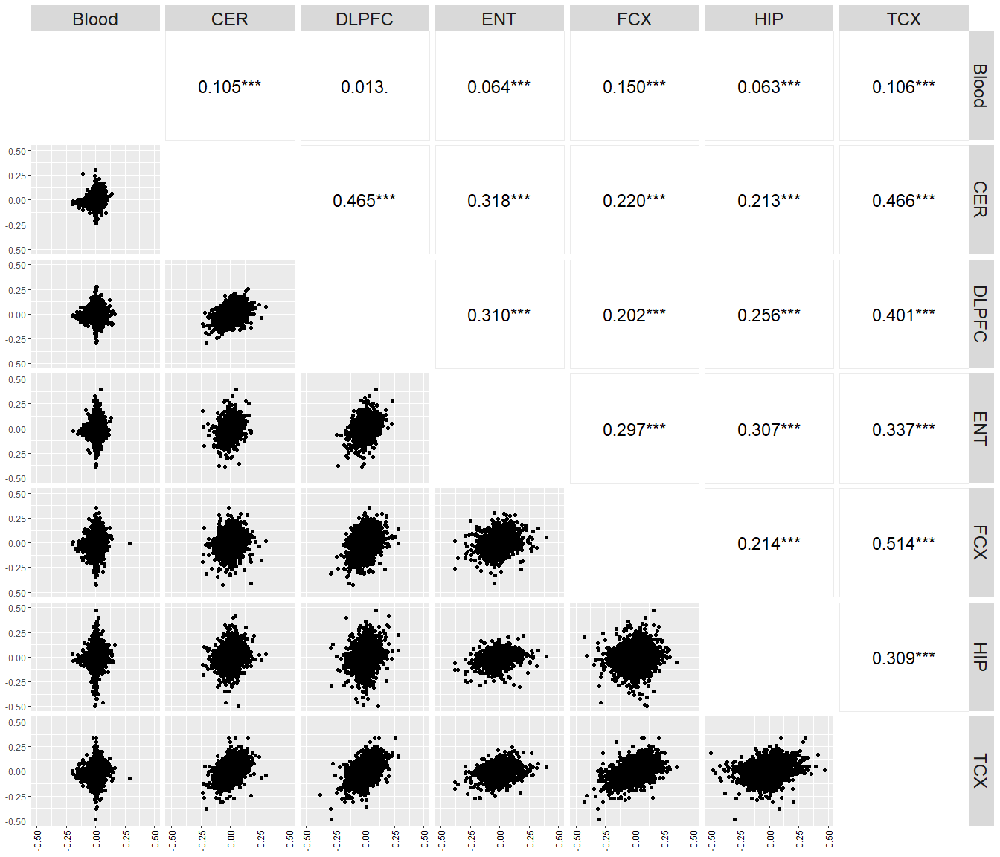

Supplementary Figure 1: pair-wise correlation plot
================

Load packages

``` r
library(tidyverse)
library(data.table)
library(dplyr)
library(plyr)
library(ggplot2)
library(devtools)
#install_github("ggobi/ggally")
library(GGally)
```

Prepare data for calculating the per-gene effect size correlation across
the whole transcriptome between any two tissues

``` r
#read meta-analysis summary statistics for blood and six brain regions
res_df = fread("D:/AD_gx/Brain_gx/20230617_brain_meta_DEGs_6region_PCgene.txt")
res_blood = fread("D:/AD_gx/Blood_gx/DEG/20220725_blood_meta_all8_geneLOC_pcGene.txt")
res_blood$region = "blood"

#combine data from blood and brain
res_brain = res_df[,c("GeneSymbol","Log2FC","region")]
res_blood = res_blood[,c("GeneSymbol","Log2FC","region")]
res_all = rbind(res_brain, res_blood)

#recode tissue names
res_all$region[res_all$region == "blood"] = "Blood"
res_all$region[res_all$region == "cerebellum"] = "CER"
res_all$region[res_all$region == "entorhinal"] = "ENT"
res_all$region[res_all$region == "frontal"] = "FCX"
res_all$region[res_all$region == "hippocampus"] = "HIP"
res_all$region[res_all$region == "temporal"] = "TCX"

#reformat the data frame to Genes x Tissues
res_test = spread(res_all, key=region, value=Log2FC)
#nrow(res_test)
#[1] 19165
```

Load the function to control the range of x- and y-axis for each
sub-plot

``` r
limitRange <- function(data, mapping, ...) { 
  ggplot(data = data, mapping = mapping, ...) + 
    geom_point(...) + 
    scale_y_continuous(limits = c(-0.5, 0.5)) +
    scale_x_continuous(limits = c(-0.5, 0.5)) 
}
```

Load and customize the function from ggally for correlation statistics
calculation and annotation

``` r
ggally_cor <- function(
  data,
  mapping,
  ...,
  stars = TRUE,
  method = "spearman",
  use = "complete.obs",
  display_grid = FALSE,
  digits = 3,
  title_args = list(...),
  group_args = list(...),
  justify_labels = "right",
  align_percent = 0.5,
  title = "Corr",
  alignPercent = warning("deprecated. Use `align_percent`"),
  displayGrid = warning("deprecated. Use `display_grid`")
) {
  if (!missing(alignPercent)) {
    warning("`alignPercent` is deprecated. Please use `align_percent` if alignment still needs to be adjusted")
    align_percent <- alignPercent
  }
  if (!missing(displayGrid)) {
    warning("`displayGrid` is deprecated. Please use `display_grid`")
    display_grid <- displayGrid
  }

  na.rm <-
    if (missing(use)) {
      # display warnings
      NA
    } else {
      (use %in% c("complete.obs", "pairwise.complete.obs", "na.or.complete"))
    }

  ggally_statistic(
    data = data,
    mapping = mapping,
    na.rm = na.rm,
    align_percent = align_percent,
    display_grid = display_grid,
    title_args = title_args,
    group_args = group_args,
    justify_labels = justify_labels,
    justify_text = "left",
    sep = "",
    title = title,
    text_fn = function(x, y) {
      #if (is_date(x)) {
        x <- as.numeric(x)
      #}
      #if (is_date(y)) {
        y <- as.numeric(y)
      #}

      corObj <- stats::cor.test(x, y, method = method, use = use)

      # make sure all values have X-many decimal places
      cor_est <- as.numeric(corObj$estimate)
      cor_txt <- formatC(cor_est, digits = digits, format = "f")


  str_c <- function(..., sep = "", collapse = NULL) {
  paste(..., sep = sep, collapse = collapse)
  }

      # if stars should be added
      if (isTRUE(stars)) {
        cor_txt <- str_c(
          cor_txt,
          GGally::signif_stars(corObj$p.value)
        )
      }

      cor_txt
    }
  )
}
```

Generate pair-wise correlation plot

``` r
assignInNamespace("ggally_cor", ggally_cor, "GGally")

g1 = ggpairs(res_test,  columns = 2:8, 
             upper = list(continuous = wrap("cor", size = 6, color = "black", title = ""), 
                          continuous = wrap( ggally_cor)),
             lower = list(continuous = limitRange),
             diag  = list(continuous = "blankDiag") ) +
             theme(strip.text = element_text(size = 18),
                   axis.text.x = element_text(angle = 90, vjust = 0.5, hjust=1, color = "black"))

g1
```

<!-- -->
