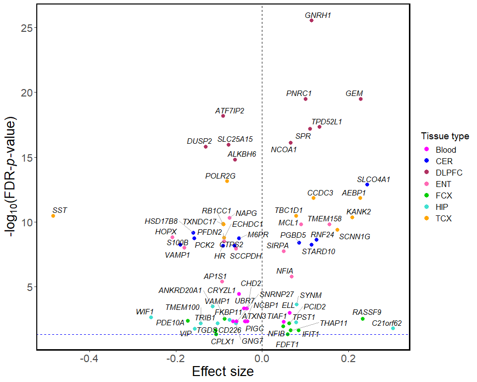

Figure 2: volcano plot
================

Load packages

``` r
library(data.table)
library(plyr)
library(ggplot2)
library(dplyr)
library(ggrepel)
```

Read meta-analysis summary statistics

``` r
res_all = fread("D:/AD_gx/Brain_gx/20230619_AD_blood_brain_DEG_summary_stats_table.csv")
```

Keep top 10 most associated genes for each tissue

``` r
res_df = res_all %>%
  group_by(region) %>%
  top_n( -10, P)
```

Reformat tissue names

``` r
res_df$region[res_df$region == "blood"] = "Blood"
res_df$region[res_df$region == "cerebellum"] = "CER"
res_df$region[res_df$region == "entorhinal"] = "ENT"
res_df$region[res_df$region == "frontal"] = "FCX"
res_df$region[res_df$region == "hippocampus"] = "HIP"
res_df$region[res_df$region == "temporal"] = "TCX"
res_df$region = factor(res_df$region)
```

Set color values for each tissue

``` r
color_set = data.frame(tissue = c("DLPFC","TCX","CER","ENT","HIP","Blood","FCX"),
            color = c("maroon","orange","blue","hotpink","turquoise","magenta","green3"))
color_set = color_set[order(color_set$tissue),]
```

Generate volcano plot for top DEGs across tissues

``` r
g1 = ggplot(res_df, aes(x = Log2FC, y = -log10(FDR))) + 
  geom_point( aes( colour = region), size = 2.5) + 
  guides(size="none", colour = guide_legend(override.aes = list(size = 3))) +
  labs(colour = "Tissue type") +
  scale_colour_manual(values = color_set$color) +
  theme_classic() + 
  theme(axis.text = element_text(size = 16), 
        axis.title = element_text(size = 20), 
        panel.border = element_rect(fill=NA,linewidth = 1.5),
        legend.text = element_text(size = 12),
        legend.title = element_text(size = 14)) +
  geom_hline(yintercept = -log10(.05), col = 'blue', linetype = "dashed") + 
  xlab( "Effect size") +
  ylab( expression(paste("-log"[10],"(FDR-",italic(p),"-value)"))) + 
  geom_vline(aes(xintercept = 0), col = 'black',lwd=0.3, linetype=2) +
  ggrepel::geom_text_repel(aes(label = GeneSymbol), size = 4, segment.size = 0.4, 
                           segment.colour = "darkgrey", 
                           fontface = 3, max.overlaps =30,
                           point.padding = unit(0.5,"points"), nudge_y = 0.1)

g1
```

<!-- -->

Save the plot

``` r
#png("D:/AD_gx/Brain_gx/20230830_AD_meta_blood_brain_volcano_pcGene_top10.png",
#     res=300,units="in",height = 8, width = 10)
#print(g1)
#dev.off()
```
